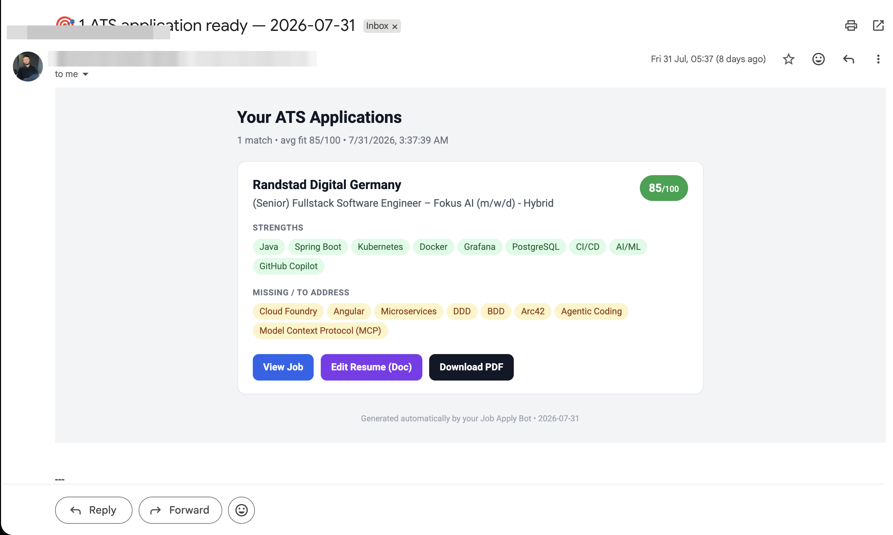
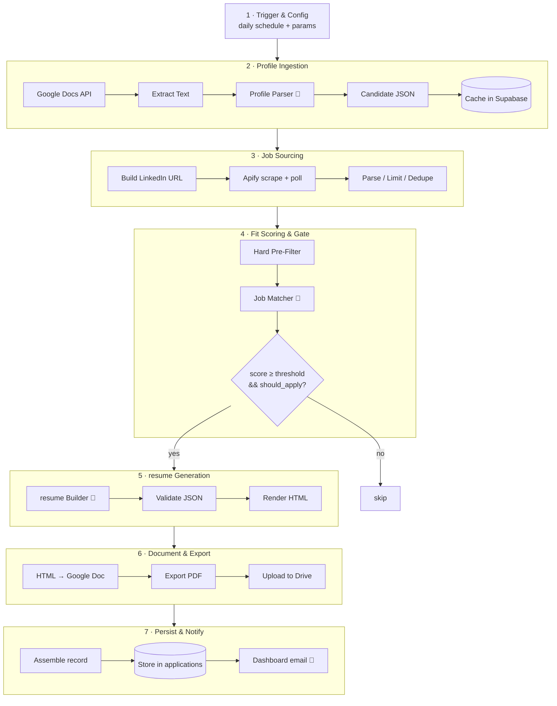
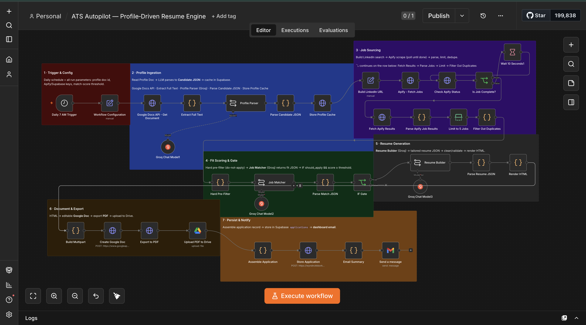

# ATS Autopilot

**An AI-powered, self-hosted engine that turns one master profile into fit-scored, job-tailored resumes ; automatically, every day.**

Built with [n8n](https://n8n.io) · [Groq](https://groq.com) (Llama 3.3 70B) · [Apify](https://apify.com) · [Supabase](https://supabase.com) · Google Docs & Drive API

  -2496ED) 

---

## Why

Tailoring a resume for every job is slow, and mass-applying to poor-fit roles wastes everyone's time. **ATS Autopilot** flips the workflow: it finds relevant roles, **decides whether each is worth applying to**, and produces a customized, ATS-friendly resume for the ones that are ; hands-off.

It's not "apply to more jobs." It's "apply to the *right* jobs, with the *right* resume."

## What it does

-  **One master profile** (a rich superset of any resume) is parsed once into structured JSON and cached.
-  **Sources fresh LinkedIn postings** (last 24h) for your target titles and locations.
-  **LLM fit-scoring gate** returns a match score, strengths, missing skills, and a `should_apply` decision ; **only qualifying jobs proceed**.
-  **Tailors a resume per job** with an LLM that *selects and rephrases* real experience ; guardrailed against inventing skills.
-  **Generates an editable Google Doc + a PDF**, saved to Drive.
-  **Logs every application** (score, keywords, links, metadata) to Postgres.
-  **Emails a dashboard** summarizing the day's matches with one-click links.

## Architecture

Seven isolated stages, three LLM calls (parse · match · write):

Full breakdown: **[docs/architecture.md](docs/architecture.md)**

## Tech stack

| Layer | Tool |
|---|---|
| Orchestration | **n8n** (self-hosted, Docker) |
| LLM | **Groq** ; `llama-3.3-70b-versatile` |
| Job sourcing | **Apify** ; `curious_coder/linkedin-jobs-scraper` |
| Storage / cache | **Supabase** (PostgreSQL) |
| Documents | **Google Docs & Drive API** (editable Doc + native PDF export) |
| Delivery | **Gmail API** |

## Quick start

1. Stand up self-hosted n8n (Docker), create the Supabase tables, and connect Google / Groq / Apify credentials.
2. Import [`workflow/ats-autopilot.json`](workflow/) and fill the **Workflow Configuration** node.
3. Write your profile from [`profile/CANDIDATE_PROFILE.example.md`](profile/CANDIDATE_PROFILE.example.md), put it in a Google Doc, and paste its ID into config.
4. Run once, verify, then activate the daily schedule.

Step-by-step: **[docs/setup.md](docs/setup.md)**

## Design decisions

- **Profile as a superset, resume as a projection.** The master profile holds *more* than any resume, so tailoring is *selection + rephrasing* ; never fabrication. A `do_not_claim` list makes the LLM honest and feeds `missing_skills`.
- **Fit-score gate first.** The most valuable node: it spends LLM tokens only on jobs worth applying to.
- **Deterministic safety nets.** Code enforces what prompts can't guarantee ; dedupe roles, drop hallucinated entries, cap projects, extract clean JSON ; so model variance never yields a broken resume.
- **One source of truth for output.** HTML → editable Google Doc → native PDF export means the Doc and PDF never drift.
- **Self-hosted.** Your profile and applications stay on infrastructure you control.

Prompts (the "secret sauce"): **[docs/prompts.md](docs/prompts.md)**

## Roadmap

- [ ] Cover-letter generation (second LLM pass)
- [ ] Standalone "Job Match Report" PDF
- [ ] Multiple resume templates (ATS-simple / modern / executive)
- [ ] Application tracking dashboard + resume version history
- [ ] `modifiedTime`-gated profile cache (skip re-parse unless the profile changed)

## Disclaimer

This is a **personal automation** for a single user's own job search. Respect the Terms of Service of any site whose data you access (job boards, LinkedIn, etc.), and use responsibly. It does not auto-submit applications ; it prepares tailored materials for you to review and send. No warranty; see [LICENSE](LICENSE).

## License

MIT ; see [LICENSE](LICENSE).
This tool is built by Saad.
