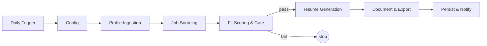

# Architecture

ATS Autopilot is a single n8n workflow organized into **7 architectural stages** with **3 LLM calls** (parse · match · write). Data flows in one linear spine; the only branch is the fit-score gate.

## Stage 1 ; Trigger & Config
| Node | Role |
|---|---|
| `Daily 7 AM Trigger1` | Schedule trigger (set to your local run time) |
| `Workflow Configuration1` | Central Set node: `profileDocId`, `jobSearchQuery`, `userEmail`, Apify/Supabase keys, `matchScoreThreshold` |

Everything downstream reads its parameters from the config node via `$('Workflow Configuration1')`.

## Stage 2 ; Profile Ingestion  🧠 (LLM #1)
| Node | Role |
|---|---|
| `Google Docs API - Get Document` | Fetch the profile Doc by `profileDocId` |
| `Extract Full Text` | Flatten the Docs API response to plain text |
| `Profile Parser` (Groq) | Convert the profile → **Candidate JSON** (strict schema) |
| `Parse Candidate JSON` | Validate/clean the LLM output |
| `Store Profile Cache` | Upsert `candidate_json` into Supabase `profile` |

**Output:** canonical Candidate JSON ; the source of truth for every later stage.

## Stage 3 ; Job Sourcing
| Node | Role |
|---|---|
| `Build LinkedIn URL` | Compose a LinkedIn search URL (24h, work-type/experience filters) |
| `Apify - Fetch Jobs1` | Start the Apify LinkedIn Jobs actor |
| `Check Apify Status1` / `Is Job Complete?1` / `Wait 10 Seconds1` | Poll until the scrape run succeeds |
| `Fetch Apify Results1` | Pull the dataset items |
| `Parse Apify Job Results1` | Normalize, strip HTML, recency-filter, dedupe within batch |
| `Limit to 5 Jobs` | Cap jobs per run |
| `Filter Out Duplicates` | Skip jobs already in `applications` (Supabase lookup) |

**Output:** a small list of fresh, unseen jobs.

## Stage 4 ; Fit Scoring & Gate  🧠 (LLM #2)
| Node | Role |
|---|---|
| `Hard Pre-Filter` | Drop `do_not_apply` job types and avoided industries before spending tokens |
| `Job Matcher` (Groq) | Return `{ match_score, should_apply, missing_skills, strengths, recommended_keywords, reason }` |
| `Parse Match JSON` | Parse + re-attach the job data |
| `IF Gate` | Pass only if `should_apply == true` **and** `match_score ≥ matchScoreThreshold` |

Language requirements (e.g. German level) are deliberately **neutral** in scoring.

**Output:** only jobs worth applying to.

## Stage 5 ; resume Generation  🧠 (LLM #3)
| Node | Role |
|---|---|
| `resume Builder` (Groq) | Produce a tailored resume JSON ; selects 3–5 bullets/role, 2–3 relevant projects, weaves recommended keywords truthfully |
| `Parse resume JSON` | Extract first JSON object; deterministic safety nets (dedupe roles, drop hallucinated/target-job entries, order roles, cap projects); merge identity/contact |
| `Render HTML` | resume JSON → styled, ATS-friendly HTML |

**Output:** clean resume JSON + HTML.

## Stage 6 ; Document & Export
| Node | Role |
|---|---|
| `Build Multipart` | Assemble a `multipart/related` body (metadata + HTML) |
| `Create Google Doc` | Drive `files.create` with conversion → **editable Google Doc** |
| `Export to PDF` | Drive `files/{id}/export?mimeType=application/pdf` → PDF binary |
| `Upload PDF to Drive` | Store the PDF in Drive |

HTML → Google Doc → native PDF export = one source of truth; the Doc and PDF never drift.

## Stage 7 ; Persist & Notify
| Node | Role |
|---|---|
| `Assemble Application` | Build the final record (links, match data, `application_json`) |
| `Store Application` | Upsert into Supabase `applications` |
| `Email Summary` | Render the dashboard HTML (fit badge, strength/missing chips, "Why", buttons) |
| `Send a message` | Deliver via Gmail |

## The three LLM calls

| Call | Node | Purpose | Determinism aid |
|---|---|---|---|
| Parse | Profile Parser | Doc → Candidate JSON | strict schema in prompt; cached so it runs rarely |
| Match | Job Matcher | Job → fit score JSON | fixed output shape; `do_not_claim` respected |
| Write | resume Builder | Profile + JD → tailored resume JSON | code-side dedupe/caps/extract-first-JSON |

All three run on Groq `llama-3.3-70b-versatile`, each with its own model node.
